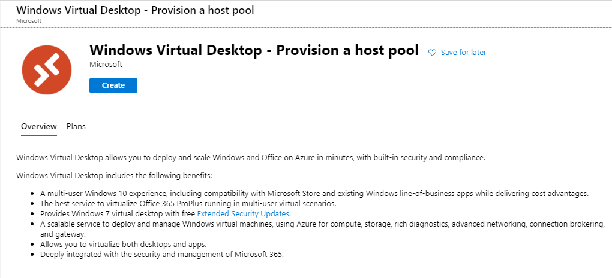

# Azure VDI / Published Apps

## SYNOPSIS

I recently ran into a use case for trying out Azure's published desktops and applications. Although other vendors like Citrix offer prebuilt apps such as a secure browser, the level of granularity and logging needed for my use case simply did not exist.  

This article will go through the setup of a basic published desktop / app.

## Assumptions & Prerequisites

- An Azure Tenant with AzureAD and an avaliable Azure subscription to provision the desktop pool. 
- Azure Domain Services already configured, The VDI pool must be able to reach the private Azure DC nodes for auth & DNS. 
[Azure Domain Services Overview](https://docs.microsoft.com/en-us/azure/active-directory-domain-services/overview)

## Environment Configuration

[Windows Virtual Desktop Official Documentation](https://docs.microsoft.com/en-us/azure/virtual-desktop/tenant-setup-azure-active-directory)

### High Level Diagram


### Admin Consent

- Admin Consent Flow to WVD App
    Open a browser and authenticate with global admin credentials [Windows Virtual Desktop Server App](https://login.microsoftonline.com/common/adminconsent?client_id=5a0aa725-4958-4b0c-80a9-34562e23f3b7&redirect_uri=https%3A%2F%2Frdweb.wvd.microsoft.com%2FRDWeb%2FConsentCallback)
- Admin Consent Flow to WVD Client
    Open a browser and authenticate with global admin credentials [Windows Virtual Desktop Client App](https://login.microsoftonline.com/common/adminconsent?client_id=fa4345a4-a730-4230-84a8-7d9651b86739&redirect_uri=https%3A%2F%2Frdweb.wvd.microsoft.com%2FRDWeb%2FConsentCallback)
- Assign the TenantCreator App Role
    Navigate to AzureAD -> Enterprise Applications -> Windows Virtual Desktopo  -> Add User -> Choose the user and assign the role 'TenantCreator'

### Create the WVD Tenant

- Download and install the [Windows Virtual Desktop Module](https://docs.microsoft.com/en-us/powershell/windows-virtual-desktop/overview/)

- Connect to Windows Virtual Desktop using the account with 'TenantCreator' role

    ```powershell
    Add-RdsAccount -DeploymentUrl "https://rdbroker.wvd.microsoft.com"
    ```
- Create a WVD tenant using your AzureAD Tenant ID and Azure Subscription ID. 

    ```powershell
    New-RdsTenant -Name <TenantName> -AadTenantId <DirectoryID> -AzureSubscriptionId <SubscriptionID>
    ```
### Create a Service Principal with WVD Owner Role (Optional)

- [Create a Service Principal for use with WVD](https://docs.microsoft.com/en-us/azure/virtual-desktop/create-service-principal-role-powershell)

### Create a Host Pool 

- From the Azure subscription -> Create a resource -> Windows Virtual Desktop - Provision a host pool



